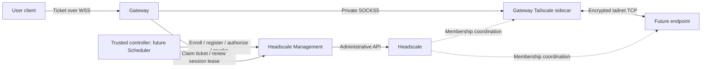

# Headscale management and gateway implementation plan

Status: design and implementation instructions only. No application code or tests
have been implemented while writing this plan.

The previous plan is preserved verbatim in
[docs/plans/worker-concurrency-review.md](docs/plans/worker-concurrency-review.md).
That review is historical material, not a prerequisite list for this feature.

## 1. Objective, scope, and defaults

Build two independent services:

- `Headscale_Management`: manages device enrollment, Headscale node lifecycle,
  verified endpoint records, and narrowly scoped access grants.
- `Gateway`: accepts authorized user connections and forwards interactive traffic
  through Tailscale to the registered endpoint.

Add unit tests and portable E2E tests with real Headscale and Tailscale. Run the
complete baseline E2E suite on GitHub-hosted Ubuntu Actions runners, including
pull requests. No local installation, self-hosted runner, production tailnet,
repository secret, paid Tailscale account, or Docker Hub login is required.

Do not implement worker access containers, interactive scheduling, a terminal UI,
Jupyter routing, native SSH ingress, remote desktop, or workload image changes.
Deploy the new management and gateway services alongside Scheduler on this Linux
host after implementation and CI validation. Keep the already-installed Headscale
daemon separate; do not replace, restart, or reset it on every push.

Defaults for choices not resolved in discussion:

1. Users reach the gateway over HTTPS/WSS without joining the tailnet.
2. First transport is `tcp-stream-v1`: binary WebSocket messages bridged to a
   registered TCP service. This proves interactive byte transport without choosing
   the eventual worker terminal protocol. Terminal framing and SSH/web adapters
   are future work.
3. Use Python, FastAPI, async I/O, SQLAlchemy, and pytest, following repository style.
4. Gateway uses a private Tailscale sidecar in userspace mode through SOCKS5. Use
   the same dialer in deployment and E2E; no direct-network fallback.
5. Gateway has persistent Tailscale state and a non-ephemeral node, enrolled with a
   short-lived single-use key. Temporary endpoints use ephemeral nodes.
6. Scheduler will eventually authorize users and orchestrate endpoint lifecycle.
   This phase includes its internal contract and a test controller, not production
   Scheduler access routes or Worker changes.
7. A trusted controller requests single-use access tickets from management. The
   gateway accepts these tickets, not ordinary Scheduler login tokens.

These are documented implementation defaults, not user selections between SSH,
browser terminals, and HTTP applications. Do not block this infrastructure phase
on those product choices.

## 2. Repository context

- Scheduler models users and job ownership in `Scheduler/app/models/`. Its
  `app/api/deps.py` validates JWTs and active users. Scheduler remains the future
  authority for identity, ownership, assignment, and access permission.
- `Scheduler/app/api/jobs_route.py` has log WebSockets, not interactive terminals.
  Do not copy its query-string login token pattern into the gateway.
- `Docker_Image_Builder/docker_ops.py` builds workload images. Supply enrollment
  credentials at runtime; never bake them into images or build logs.
- `Worker/executor.py` launches batch containers through the Docker CLI and reads
  stdout. No Worker changes are necessary in this phase.
- `.github/workflows/ci.yml` runs component unit tests on Python 3.11/3.12 and has
  a separate registry-dependent builder E2E job. Add an independent network E2E
  job; do not couple it to Docker Hub credentials or the macOS deployment runner.
- Installed Headscale is v0.29.3. Selected settings show a loopback listener, file
  policy mode with an empty path, and embedded DERP disabled. These observations
  are not settings to copy blindly or permission to modify the host.

## 3. Architecture and trust model



Headscale coordinates membership and policy. The gateway and Tailscale carry
interactive data; DERP may relay encrypted packets. Management is not in the
byte-forwarding path. A Headscale connection alone does not authorize a user.

| Credential | Holder | Allowed purpose |
| --- | --- | --- |
| Headscale admin API key | Management only | Enrollment key operations, node inspection/removal |
| Controller service credential | Future Scheduler; test controller now | Enroll endpoints, register/lease resources, issue/revoke grants |
| Gateway service credential | Gateway only | Confirm own enrollment, probe endpoints, claim/renew/release sessions |
| Restricted bootstrap credential | Gateway enrollment helper | Enroll only its configured gateway identity |
| Enrollment pre-authentication key | Intended Tailscale client temporarily | Join once |
| Grant signing private key | Management only | Sign connection tickets |
| Verification public keys | Gateway | Verify ticket signatures and key IDs |
| Connection ticket | User temporarily | Open one session to one resource generation |

Use separate high-entropy credentials and explicit role permissions. Gateway must
not have administrative privileges. Support secret files and reject missing/default
production secrets. Never log tickets, keys, authorization headers, request bodies
containing secrets, or terminal bytes. Verify TLS outside the isolated CI setup.
Management API and SOCKS/LocalAPI listeners are private.

Tagged Headscale nodes are service identities. Resource ownership must come from
the trusted controller, not Headscale user names, hostnames, tags, or client IPs.
The test controller is a fixture, never a production bypass authentication mode.

## 4. Deliverables and layout

Use unique package names to avoid collisions with Scheduler's `app` imports.

```text
Headscale_Management/
  headscale_management/
    main.py, config.py, auth.py, schemas.py
    headscale_client.py, database.py, models.py
    enrollment_service.py, endpoint_service.py, grant_service.py
    reconciliation.py
  migrations/
  test/unit/
  requirements.txt, requirements-test.txt, pytest.ini
  Dockerfile, README.md, .env.example
Gateway/
  interactive_gateway/
    main.py, config.py, auth.py, schemas.py
    management_client.py, tailnet_dialer.py, relay.py, sessions.py
  test/unit/
  requirements.txt, requirements-test.txt, pytest.ini
  Dockerfile, README.md, .env.example
test/interactive_e2e/
  conftest.py, test_enrollment.py, test_gateway.py
  test_isolation.py, test_lifecycle.py
  fixtures/echo_endpoint.py, fixtures/controller.py
  compose.yaml, headscale-config.yaml, policy.hujson
  run.py, requirements.txt, pytest.ini
docs/interactive-access-contract.md
deploy/interactive/compose.yaml
restart.sh (post-push deployment entry point)
```

Pin dependency versions and public container images after compatibility validation.
Start with Headscale v0.29.3. Select and prove an exact compatible Tailscale release
in milestone M1; do not invent a version or rely on mutable `latest` tags.
Record the tested pair and image digests in documentation and fixtures.

## 5. Persistence, enrollment, and resource lifecycle

Use SQLAlchemy and file-backed SQLite initially, with migrations, foreign keys,
WAL, and bounded busy timeout. One management process and reconciler are supported;
HA/PostgreSQL are future work. Use DB uniqueness and atomic transitions even in
this initial deployment: concurrent HTTP requests must not bypass invariants.
Do not create tables as a side effect of importing modules.

Minimum durable records:

| Record | Required data |
| --- | --- |
| Enrollment | UUID, idempotency key/request hash, role, resource/gateway ID, generation, expected tags, expiry, Headscale key ID, temporary encrypted key, verified node ID, lifecycle/retry state, timestamps |
| Endpoint | Resource ID, immutable owner ID, assignment generation, named service, protocol, allowlisted port, enrollment ID, verified node ID and IPs, endpoint version, lease expiry, state |
| Grant | Ticket jti, user/resource/generation/service, gateway ID, admission expiry, absolute session deadline, issued/claimed/revoked state |
| Session | UUID, grant ID, gateway ID/request UUID, immutable endpoint version, lease expiry, absolute deadline, active/released/revoked state |

Store temporary enrollment keys encrypted at rest using a separate configured
secret. Idempotent replay may return the same key only to the same authorized role
while pending and unexpired. Delete ciphertext after confirmation, expiry, or
revocation. List/status APIs must be redacted.

Enrollment progression:

```text
PENDING -> KEY_ISSUED -> CONFIRMED
                   -> EXPIRED
                   -> REVOKING -> REVOKED
PENDING -> UNKNOWN_RESULT / FAILED
```

Endpoint progression:

```text
ENROLLING -> REGISTERED -> READY -> OFFLINE
             any live state -> REVOKING -> REVOKED
```

Lifecycle rules:

- Controller supplies an opaque assignment generation as a fencing token.
  Reassignment creates a new version/enrollment and invalidates old grants/sessions.
  Old confirmations, lease renewals, and probe results return 409.
- Associate nodes by Headscale `pre_auth_key.id` plus expected tags and the issued
  enrollment record. Hostname alone is insufficient. Prove that v0.29.3's real
  tagged-node response contains this association in M1. If not, explicitly redesign
  correlation before proceeding; do not quietly fall back to hostname matching.
- Obtain tailnet IPs from Headscale. Validate configured tailnet ranges; reject
  external, loopback, bridge, self/gateway addresses and unallowlisted ports.
- Membership/online status is not application readiness. Controller registration,
  an unexpired resource lease, fresh verified membership, and successful gateway
  probe of the exact endpoint are all required for READY.
- Default enrollment key TTL: 5 minutes; reusable=false. Endpoint ephemeral=true;
  gateway ephemeral=false. Restrict tags by role; callers cannot override them.
- Enrollment-key expiry prevents joining; it does not revoke an enrolled node.
  Revocation denies access locally first, then expires/deletes the exact node and
  any unused key. Do not rely only on eventual ephemeral-node cleanup.
- Reconcile every 5 seconds. Membership observations are valid for at most 15
  seconds by default. Handle pending confirmation, lease expiry, offline nodes,
  and retryable cleanup. An outage must never publish new READY records.
- Retry safe reads and idempotent cleanup with bounded backoff/jitter. Do not
  blindly retry key creation after an ambiguous timeout: Headscale does not share
  the management service's DB transaction. Persist UNKNOWN_RESULT; bound orphan
  keys by the requested TTL; allow explicit replacement after that window. Never
  adopt/delete unrelated keys by name or timestamp heuristics.
- Handle crash after Headscale success and before local commit without authorizing
  an untracked node. Persist revocation tombstones so late enrollment/confirmation
  cannot resurrect access; reconcile and remove late nodes matching revoked keys.
- Cleanup touches exact IDs associated with this service's records only. Never
  bulk-delete existing Headscale users, nodes, or keys.

## 6. Internal management API

Use `/internal/v1`, strict Pydantic schemas, UTC timestamps, bounded input lengths,
OpenAPI documentation, and rejected unknown mutation fields.

| Method / path | Role | Contract |
| --- | --- | --- |
| POST `/enrollments` | Controller; restricted bootstrap | Idempotency-Key; role/identity/generation; return key, expiry, enrollment ID, login-server URL, expected tags/hostname |
| GET `/enrollments/{id}` | Controller; gateway for itself | Redacted status and verified membership |
| POST `/enrollments/{id}/confirm` | Controller; gateway for itself | Reconcile actual Headscale membership; reject caller-selected IP |
| DELETE `/enrollments/{id}` | Controller | Deny local access first, then schedule key/node cleanup |
| PUT `/resources/{id}/endpoint` | Controller | Register owner, generation, enrollment, service, protocol/port; validate binding |
| POST `/resources/{id}/lease` | Controller | Renew only live current generation |
| GET `/gateways/{id}/probe-targets` | Matching gateway | Registered/unexpired endpoints requiring a probe |
| POST `/resources/{id}/probe-result` | Gateway | Exact assigned probe/version result; stale results cannot create READY |
| DELETE `/resources/{id}` | Controller | Revoke endpoint/grants/sessions/enrollment; expose cleanup status |
| POST `/access-grants` | Controller | Enforce owner equality, current generation, readiness; sign single-use ticket |
| POST `/sessions/claim` | Gateway | Atomically consume ticket and return verified destination/version/lease |
| POST `/sessions/{id}/renew` | Owning gateway | Recheck resource, grant, version, observation freshness and deadlines |
| POST `/sessions/{id}/release` | Owning gateway | Idempotent release |
| DELETE `/access-grants/{id}` | Controller | Revoke grant and active session |

A controller access decision is required before grant issuance. Owner equality is
defense in depth, not a replacement for eventual Scheduler active-user/assignment
checks. Test controller enforces an explicit permission table with users A/B and
resources A/B, rather than accepting any supplied user ID.

Use asymmetric ticket signing, e.g. Ed25519 through a verified compatible JWT
library. Fix the algorithm. Include `kid` and support bounded public-key overlap
for rotation. Claims: issuer, gateway audience, sub/user ID, jti, iat, nbf, exp,
resource ID, assignment generation, service name and `tcp-stream-v1`.
Default admission TTL is 60 seconds. Active-session maximum is separately 30
minutes: admission expiry does not terminate a session admitted in time.

Gateway supplies a stable request UUID for claim. Retrying a lost response with
that same UUID returns the same session. A different UUID cannot replay the
single-use grant. Gateway must also prevent duplicate concurrent relays for the
same claimed session.

Errors: 401 invalid credentials/ticket; 403 wrong role/owner; 404 unavailable;
409 idempotency conflict/stale generation; 410 revoked/expired; 422 invalid
endpoint; 503 unavailable control service. Public errors never reveal another
user's destination or enrollment metadata.

## 7. Gateway protocol and lifecycle

Public endpoints:

- `GET /health/live`: process liveness, no external calls.
- `GET /health/ready`: bounded management/own-enrollment checks, sidecar Running
  status, private SOCKS listener, configured verification keys.
- `WS /v1/connect/{resource_id}/{service}`: authenticated `tcp-stream-v1` relay.

Connection sequence:

1. Enforce browser Origin allowlist. Explicit CLI mode may omit Origin; never
   accept arbitrary browser Origins.
2. Accept into a bounded authentication phase, default 5 seconds. Require a small
   first JSON message: `{ "type": "authenticate", "ticket": "..." }`.
   No credentials in URL/query strings. No endpoint dial/forwarding before auth.
3. Verify fixed algorithm/signature, issuer/audience/time claims, resource/service
   path match, protocol, and size limits.
4. Claim through management with gateway credential and stable request UUID.
   Management resolves destination; users cannot request arbitrary IPs or ports.
5. Revalidate returned endpoint, reserve session capacity, and dial through private
   SOCKS5 only. Never retry using a direct socket after SOCKS failure.
6. Send `ready` control JSON, then relay binary frames in both directions. Reject
   further text/control frames in this first protocol. WebSocket frame boundaries
   have no significance to the TCP stream.
7. Renew authorization every 5 seconds with a default 15-second lease. On failed
   renewal, close no later than the existing lease expiry. No indefinite cached
   authorization. Version change/revocation closes the active stream.
8. On EOF, client disconnect, errors, cancellation, idle/absolute deadline,
   revocation or shutdown: cancel sibling tasks, close both transports, release
   capacity and attempt idempotent management release.

Bound maximum frame to 64 KiB, read/queue sizes, and total/per-user connections.
Await writes for backpressure. Default idle deadline is 5 minutes. Bound unauthenticated
connections as well. Every failure branch releases reservations. Initial TCP EOF
closes the whole WebSocket; half-close/terminal resize framing is future work.

Document close codes: 4401 invalid ticket, 4403 denied, 4408 authentication timeout,
4410 revoked/stale, 1013 capacity/control unavailable, 1011 transport failure.
Log IDs, outcomes, durations and byte counts, never byte contents or secrets.

An enrollment helper uses the restricted bootstrap credential to enroll gateway
sidecar and gateway credential to confirm its own membership. Preserve sidecar
state across restarts; mint a key only when membership is absent/expired. Ordinary
process restart is not decommissioning. Explicit decommission removes its node.
Gateway does not interpret shell commands and has no Docker socket.

## 8. Tailnet policy and isolated E2E topology

Controlled roles: `tag:interactive-gateway`, `tag:interactive-endpoint`.
Allow gateway-initiated TCP to endpoint port 9000. Deny other new connections,
including endpoint-to-endpoint and endpoint-to-gateway initiation. Established
return traffic needs no reverse initiation rule. No subnet/exit routes, Funnel,
or Tailscale SSH. Use explicit policy; never depend on permissive defaults.

Validate policy/tag ownership against v0.29.3 and the pinned client. Prefer grants
if supported by the tested pair. Install policy before clients join. Role-level
network rules permit gateway access to all endpoints on that service port;
per-user isolation belongs to grant authorization in the gateway.

Policy is a deployment artifact in this phase. Management verifies required policy
through the pinned API but does not overwrite an existing host's policy. No
policy-write endpoint in the management application.

Launch Docker Compose through workflow steps with a unique project name:

- Controller network: test driver/controller, management, gateway control interface.
- Headscale transport/control network: disposable Headscale, sidecars and private
  DERP fixture. Test driver does not join this network.
- Each echo endpoint shares a network namespace with its own sidecar, but binds
  only `127.0.0.1:9000`. Publish it on tailnet TCP 9000 using the pinned Tailscale
  Serve TCP forwarding command. No host port or bridge-address echo listener.

Verify userspace TCP Serve works with the pinned pair without managed HTTPS
certificates. All clients use a login-server container hostname resolvable in
that network; localhost never identifies another container. User test driver
reaches only gateway WebSocket ingress. It cannot bypass the gateway to endpoints.
Gateway uses verified tailnet IPs through SOCKS5, not Compose service names.

Use v0.29.3's configuration example with disposable DB/state and explicit policy.
Isolated CI may use HTTP for Headscale; production requires trusted TLS.
Do not depend on public DERP services: configure private DERP/map and disable
public-map fetching. Verify embedded/dedicated DERP requirements for pinned
versions. If TLS is required, generate test CA and correct container-DNS SAN
certificates and install CA in clients; do not disable TLS verification globally.

Baseline proves real tailnet access on one runner. A later forced-relay scenario
must filter direct transport and demonstrate actual relay usage; it is not a
prerequisite for completing baseline unless this compatibility spike reveals
that private relay is necessary. Neither scenario validates arbitrary home NAT
or the installed Headscale configuration on this machine.

## 9. Unit test requirements

Inject clocks, repositories, Headscale clients, HTTP transports and dialers.
Unit tests require no Docker, live network, registry credentials or local state.
Test observable invariants rather than merely mirroring implementation calls.

Management:

- Invalid configuration/secrets/roles/ports/TTL combinations rejected.
- Pinned API parsing: string-encoded uint64 IDs, timestamps, tags, missing fields.
- Safe retry versus ambiguous creation; 401/403 and idempotent 404 cleanup.
- Concurrent idempotent enrollment creates one record; changed payload conflicts.
- Enforced tags, single-use and ephemeral flags cannot be caller-overridden.
- Wrong key ID/tags rejected even with matching hostname; foreign/self IP rejected.
- READY requires membership, registration, lease and exact successful probe.
- Stale generation cannot confirm/register/renew/probe/claim.
- Wrong owner, unready endpoint, expiry, revocation, wrong audience/gateway and
  altered ticket/signature/algorithm denied.
- Real transaction test: concurrent claims consume once; identical request-ID
  retry returns one session, a different request cannot replay.
- Local revocation precedes remote cleanup; cleanup failure retries; unrelated
  nodes untouched; late enrollment cannot resurrect revoked resource.
- File-backed restart preserves mapping/replay state; key ciphertext removed on
  terminal lifecycle transitions.
- Gateway role cannot issue tickets, change owners, enroll arbitrary identities,
  revoke resources, or read enrollment secrets.

Gateway:

- Invalid Origin/auth timeout/ticket/path/claim failure never dials.
- Destination/port revalidation and SOCKS-only dialing; no fallback socket.
- Duplicate claim retry does not create two relays.
- Binary forwarding including NUL/non-UTF8, correct concurrent resource routing.
- Slow peer backpressure remains bounded.
- EOF, disconnect, cancellation, shutdown, dial failure, capacity limit, idle,
  absolute duration, revocation and lease loss close resources/release capacity.
- Admission expiry is distinct from active-session deadline.
- Error/log redaction covers secrets and byte contents.

## 10. Real E2E scenarios

Use actual service APIs, real Tailscale processes and real TCP. No ready-record DB
injection or mocked Headscale enrollment. Only future Scheduler is replaced by
the explicit test controller permission table.

Fixture startup:

1. Create unique project/temp state, signing/encryption material and role secrets.
2. Start disposable Headscale with policy/private relay configuration.
3. Generate its admin key with a one-off CLI invocation and deliver secret file
   to management without printing it in CI.
4. Start management, controller, gateway/helper and persistent-state sidecar.
5. Enroll through management, consume keys, confirm actual exact node binding.
6. Enroll A/B endpoints, start private echo/Serve, register different owners and
   current generations, lease them, await real gateway probe and READY.
7. Request tickets through controller and execute scenarios below.

| Scenario | Evidence required |
| --- | --- |
| Enrollment | Real node/key association, role tags and ephemeral attributes match |
| Key reuse | Fresh sidecar state cannot join with already consumed key |
| Key expiry | Fresh state cannot join after an unused short-TTL key expires |
| Forwarding A/B | Endpoint-specific prefixes/nonces, random binary exact bytes and concurrent sessions prove destination correctness |
| Owner authorization | Controller denies user A requesting B; changing A-ticket path cannot reach B |
| Ticket integrity/replay | Forged signature, audience mismatch and second claim rejected |
| No shortcut | Bridge/host-port direct echo access fails while SOCKS-to-tailnet access works |
| Peer policy | A cannot dial B:9000 or gateway canary; gateway reaches B before/after denial |
| Port policy | Gateway cannot dial endpoint's unallowlisted canary port; canary independently confirmed listening |
| Generation replacement | Old ticket/live stream invalidated; new version works and does not route to old node |
| Revocation | Admission fails immediately; live stream closes within lease bound; exact node cleanup completes |
| Endpoint offline | READY/access removed within observation bound; session lease cannot renew |
| Management outage | New admission fails; active stream closes at lease bound |
| Headscale outage | Enrollment/new READY unavailable; do not assume existing WireGuard streams stop immediately; test authorization revocation separately |
| Restart | Mounted gateway state retains identity; management retains replay prevention; endpoint re-probe restores readiness |
| Cleanup isolation | Run-owned nodes removed; unrelated sentinel survives until fixture teardown |

Attack from a peer through its own SOCKS proxy and tailnet destination, not Docker
bridge addressing. Timeout alone does not prove policy denial: use working
positive controls, exact TCP listener checks and sanitized policy/node evidence.
Do not substitute ICMP ping for TCP enforcement. Test gateway canary listener is
fixture-only, not a production control service exposed to the tailnet.

Use bounded deadline polling, short test lease/TTL overrides and timing tolerances;
no long fixed sleeps. Freeze time only in units. Missing infrastructure, zero
selected tests or skipped required scenarios must fail CI rather than pass silently.

## 11. GitHub Actions and harness

Extend existing unit matrix with `Headscale_Management` and `Gateway` on Python
3.11/3.12. Install component runtime/test requirements; isolate imports, temporary
DB and environment. Tests must not load root production `.env` by accident.

Add `interactive-network-e2e` on a pinned supported Ubuntu image, e.g.
`ubuntu-24.04`, Python 3.11, 15-minute timeout, `permissions: contents: read`.
Run on existing push/pull_request/workflow_dispatch events including fork PRs.
No repository secrets, production login-server URL, or `pull_request_target`.

Steps:

1. Checkout, set up Python, install pinned E2E requirements.
2. Check Docker/Compose and record safe version metadata.
3. Pull pinned public Headscale/Tailscale images; build local application/fixtures.
4. Run `test/interactive_e2e/run.py`; project name derives from run ID and attempt.
   Harness starts fixtures, runs pytest and produces JUnit results.
5. Always collect sanitized logs/node-policy summaries before teardown. Never
   upload databases, private keys, env files, full Docker inspect output or
   unredacted Headscale key listings.
6. Always tear down this project's containers/volumes/orphans, including failure.
   Harness `finally` plus workflow `if: always()` cleanup fallback.
7. Upload sanitized failure diagnostics/JUnit with bounded retention.

No fixed global container names or host-wide Docker cleanup. Preserve primary
pytest failure exit status when diagnostics/cleanup also fail; report secondary
failures separately. Deadlines must fit within workflow job timeout.

Once green, add E2E job to deploy `needs` if deploy should require all tests.
Keep portable E2E isolated from production. After CI passes, use the existing
post-push deployment path and restart.sh to update this Linux host as specified
in section 15. Do not alter existing builder registry E2E behavior.
Branch protection is a separate repository administration task; workflow `needs`
does not itself configure a required PR check.

## 12. End-to-end implementation milestones

### M1: Compatibility and contract

- Read applicable AGENTS.md and repository test conventions.
- Verify v0.29.3 REST/OpenAPI routes, key/node correlation and tagged semantics.
- Pin compatible Tailscale image; validate policy, userspace SOCKS and TCP Serve.
- Prove real tailnet forwarding and denied peer initiation with positive controls.
- Write contract document: schemas, role matrix, idempotency, fencing, readiness,
  ticket/lease semantics and initial WebSocket protocol.

Exit: no unverified API/transport assumptions remain. If correlation/Serve fails,
resolve design explicitly before implementing service logic. Use only disposable
fixtures; never change this host's installed Headscale.

### M2: Enrollment service

- Build management package, config, role auth, health, migrations and adapter.
- Implement durable idempotent enrollment/key encryption, confirmation,
  reconciliation, cleanup and restart behavior.
- Add unit tests and real enrollment E2E.

Exit: enrollment/key association/expiry/revocation and exact-ID cleanup pass.

### M3: Registry and authorization

- Implement endpoint registration, current-generation leases and replacement.
- Implement gateway probes/readiness, asymmetric signing, single-use claim,
  session renew/release and grant/resource revocation.
- Add test controller permission table and meaningful transaction/concurrency tests.

Exit: wrong owner/generation/gateway cannot gain access; replay prevention survives
restart; revocation denies locally before remote cleanup.

### M4: Gateway

- Implement restricted bootstrap helper and persistent-state sidecar integration.
- Implement handshake, verification, claim, SOCKS dialer, relay, capacity limits,
  probe loop, renewal, shutdown and redacted logs.
- Add gateway units and real bidirectional/concurrent binary-routing E2E.

Exit: authorized routing works, rejection never dials, all failure paths clean up,
and no direct-network fallback exists.

### M5: E2E and GitHub CI

- Complete isolated Compose topology/harness and every required section 10 scenario.
- Extend unit matrix and add independent GitHub-hosted network E2E job.
- Inspect actual Actions results before claiming CI compatibility. Running locally
  is optional, not a prerequisite.
- Deliberately fail a test to verify cleanup and safe artifact collection.
- Add deployment test dependency and implement the section 15 production Compose
  contract consumed by restart.sh; validate restart orchestration with fake Docker
  and a disposable-stack E2E before enabling production deployment.

Exit: PR E2E passes without secrets; failures remain failures, cleanup is reliable,
and artifacts contain no credentials. Production deployment configuration and
restart sequencing are ready for the existing post-push host runner.

### M6: Documentation and integration handoff

- Document config/secrets, migration/state volume, rotation, restart,
  decommission, policy ownership, CI invocation and troubleshooting.
- Give internal API examples with placeholders only.
- Document future Scheduler responsibilities: active-user/owner/assignment checks,
  generation creation, enrollment/registration, lease/revoke, grant requests and
  delivery of ticket/gateway URL to client.
- Document only future endpoint boundary: consume intended runtime key, expose
  named service, report through authenticated controller and honor decommissioning.
- Explain that host owners control local containers/secrets; membership alone is
  not proof of trusted workload code.

Exit: future Scheduler/Worker integrations can follow stable contracts without
redesigning enrollment identity, resource fencing or gateway sessions.

## 13. Verification and completion criteria

Expected commands after implementation; these scripts/tests do not exist yet:

```bash
cd Headscale_Management
python -m pytest test/unit -q
```

```bash
cd Gateway
python -m pytest test/unit -q
```

Optional repository-root invocation of the same portable harness as CI:

```bash
python test/interactive_e2e/run.py
```

Run existing Scheduler, builder and Worker unit CI jobs to verify matrix changes
are compatible. Registry-credential-dependent builder E2E is not a prerequisite
for developing this isolated network suite.

Done means both services and documented contracts are implemented, required real
E2E passes on GitHub-hosted CI, credentials stay out of logs/images/artifacts,
and lifecycle/replay/fencing/bounded authorization and restart orchestration are
tested. Existing production Headscale and Scheduler persistent state must not be
reset by deployment. The new services and restart.sh integration are included;
Scheduler application behavior and Worker/image logic remain outside this phase.

Record native SSH, terminal framing/UI, HTTP apps, interactive orchestration,
HA and real cross-machine deployment verification as future work. Do not hide
these as undocumented prerequisites or claim the portable suite validates them.

## 14. Primary references

Use exact pinned schema/config first; current docs may differ from selected pair.

- [Headscale registration](https://headscale.net/stable/ref/registration/)
- [Headscale administrative API](https://headscale.net/stable/ref/api/)
- [Headscale network policy](https://headscale.net/stable/ref/policy/)
- [Headscale DERP](https://headscale.net/stable/ref/derp/)
- [v0.29.3 REST service routes](https://github.com/juanfont/headscale/blob/v0.29.3/proto/headscale/v1/headscale.proto)
- [v0.29.3 node schema](https://github.com/juanfont/headscale/blob/v0.29.3/proto/headscale/v1/node.proto)
- [v0.29.3 pre-auth-key schema](https://github.com/juanfont/headscale/blob/v0.29.3/proto/headscale/v1/preauthkey.proto)
- [v0.29.3 config example](https://github.com/juanfont/headscale/blob/v0.29.3/config-example.yaml)
- [Tailscale userspace mode](https://tailscale.com/docs/concepts/userspace-networking)
- [Tailscale Serve TCP](https://tailscale.com/docs/reference/tailscale-cli/serve)
- [GitHub Actions Docker networking](https://docs.github.com/en/actions/tutorials/use-containerized-services/use-docker-service-containers)
- [Compose health-checked updates](https://docs.docker.com/reference/cli/docker/compose/up/)
- [Compose dependency readiness](https://docs.docker.com/compose/how-tos/startup-order/)
- [Compose volume removal behavior](https://docs.docker.com/reference/cli/docker/compose/down/)


## 15. Same-host production deployment and restart.sh

### Placement and exposure

Initially host Scheduler, Headscale Management and Gateway on this Linux machine.
This keeps controller calls local and uses the existing Headscale installation.
Keep separate services and state volumes so they can move to different hosts later.
The gateway needs bandwidth for all interactive connections and shares this host's
availability/failure domain. This is acceptable for the initial single-host setup;
it is not an HA architecture. Apply CPU/memory limits and log rotation so gateway
traffic cannot starve Scheduler or Headscale.

The installed Headscale systemd daemon is external infrastructure, not a service
inside the new Compose project. The push hook must not restart its systemd unit,
create a second production Headscale, or touch its database/configuration.
Management must verify its administrative connection and required policy; fail
readiness if either is unavailable. Provision required policy separately and
validate it without overwriting rules used by existing devices.

Expose only gateway HTTPS/WSS through the host's existing TLS reverse proxy.
Bind its plain HTTP ingress to a loopback-published port (e.g. 127.0.0.1:8030),
configure WebSocket upgrades, streaming timeouts, Origin allowlist and certificate
validation. Management stays on a private Docker network, without public host
ports. Eventually attach Scheduler to a stable explicitly managed private control
network to reach management by service DNS; do not depend on scheduler_default,
because the legacy restart script tore that network down.

Resolve the existing loopback-only Headscale listener deliberately: localhost in
management's bridge container is not the host. Prefer the existing HTTPS Headscale
URL if its administrative API is reachable from that container with valid TLS and
appropriate reverse-proxy access restrictions. If unavailable, provision a narrowly
scoped host proxy/private interface for management; do not simply point
host.docker.internal at a 127.0.0.1-only listener and assume it works. Never broaden
Headscale admin exposure to all machines. Record/probe the chosen endpoint before
production cutover; portable CI continues to use disposable fixtures.

### Production Compose contract

Create deploy/interactive/compose.yaml, project dml-interactive. restart.sh already
contains the orchestration scaffold for these exact service names:

| Service | Responsibility and readiness |
| --- | --- |
| management | One application process/reconciler; readiness checks admin API, schema, required policy and signing/encryption configuration; must not depend on gateway becoming ready |
| tailscale | Userspace sidecar; pre-bootstrap health checks local daemon/socket/SOCKS startup only, avoiding enrollment deadlock |
| bootstrap | One-off idempotent enrollment/confirmation helper; exits successfully only when existing or newly enrolled gateway is valid; bounded timeout |
| gateway | Uses current tailscale namespace with network_mode service:tailscale; readiness includes its actual membership, management and SOCKS path; does not require any worker endpoints yet |
| migrate | One-off explicit migrations, using the newly built management image and management DB volume; failure aborts deployment |

Use explicit image names shared by management/migrate/bootstrap as appropriate;
`build management gateway` must provide every local image needed by one-off jobs.
Provide actual healthchecks with packaged tools, bounded timeouts and start periods.
`up --wait` is meaningful only when readiness is implemented, not merely container
running. Set restart: unless-stopped for long-running services, never one-off jobs.
Set stop_grace_period and implement cancellation/cleanup on SIGTERM.

Place gateway listener port mapping on tailscale's shared namespace when required
by Compose, not on a gateway using network_mode service:tailscale. Restrict SOCKS
and LocalAPI to loopback/private namespace; they must not be published.
Mount persistent named volumes with stable names for management DB and Tailscale
state. Encryption/signing keys, gateway identity and service credentials stay stable
across pushes. Secret files and /etc/distributed-ml/interactive.env are provisioned
on the host outside version control, readable only by deployment/service identities.
Do not regenerate secrets or enrollment on each restart. Support ARM64 images
because the inspected host's Headscale binary is linux/arm64.

### Restart sequence and failure semantics

restart.sh runs after pushes according to the user's deployment setup. Preserve
that entry point and verify the actual host hook invokes the updated checkout.
The checked-in Actions deploy job currently targets a macOS runner/external script;
do not assume it updates this Linux host. Locate/document the actual hook when
implementing deployment; tests remain GitHub-hosted Ubuntu regardless.

The script now follows this sequence; finish and validate its Compose integration
as part of M5 rather than adding unrelated per-push commands:

1. Resolve paths from script location, validate settings/tools and acquire flock
   for the checkout. Serialize the entire update; simultaneous pushes must not
   race migrations, enrollment or namespace replacement.
2. Check Docker, Scheduler Compose config and, when present, interactive Compose
   config/host environment without printing expanded config or secrets.
3. Build Scheduler api and both new application images before stopping any running
   application. A build failure leaves the currently running services intact.
4. Bring up Scheduler db/redis without deleting volumes, recreate api and require
   bounded HTTP readiness. Do not remove images or stop containers by network filter.
5. Stop gateway and management writers, retaining sidecar and all state. This is
   a bounded maintenance window. Back up management state using a SQLite-consistent
   backup before nontrivial migrations and use forward/backward-compatible changes.
6. Run migrate with new image. On failure abort, return nonzero, preserve state and
   report partial deployment; no automatic reset or unsafe rollback of DB schema.
7. Recreate management and wait for readiness. Do not proceed on Headscale outage.
8. Ensure tailscale runs; do not force-recreate it on every push. When image/config
   changes recreate it, gateway must subsequently recreate against current namespace.
9. Run bootstrap idempotently. Existing valid state reuses node ID; no leaked keys,
   duplicate registrations, reusable permanent auth key or restart-loop reenrollment.
10. Recreate gateway and wait for actual health. Verify reverse-proxy WSS path in
    host deployment validation; API container health alone does not prove ingress.
11. Print service status and report success only for services actually validated.
    On failure return nonzero with safe status diagnostics; never use blanket
    `|| true` to hide build, migration, enrollment or readiness failures.

Short interruption of active interactive sessions on push is expected initially.
Document this, graceful shutdown and retry/new-ticket behavior. The script is not
an atomic rollback mechanism or zero-downtime deployment. A failure after Scheduler
update may leave a partial update, which must be reported accurately.

### Pre-implementation compatibility and enabling deployment

The application/production Compose files do not exist yet. To keep today's push
hook usable, restart.sh explicitly reports Scheduler-only updates when the new
manifest is absent and no dml-interactive containers exist. It does not pretend
management/gateway started. If a manifest exists, missing env/config/failed health
is a hard error; it never silently skips them.

Set REQUIRE_INTERACTIVE=1 in the production push-hook environment when first enabling
this stack; thereafter missing manifest must fail before Scheduler is changed.
The script also rejects missing manifest if any dml-interactive containers already
exist. Set INTERACTIVE_ENV_FILE if host config is at another protected path;
RESTART_WAIT_TIMEOUT defaults to 120 seconds. Do not add feature-disable fallbacks
that accidentally mask an already-enabled stack's broken deployment.

The old script used `compose down -v` and stopped all scheduler_default containers.
Both are removed from the revised script. Scheduler's existing database service
has no explicit persistent volume in its Compose file: before production database
container recreation, add a named volume and deliberately migrate/backup existing
Postgres data. Merely adding an empty volume does not migrate current data.
Ordinary pushes must never recreate/delete database storage. Add meaningful
Postgres/Redis healthchecks so API startup waits for infrastructure readiness;
keep Scheduler application behavior unchanged.

### Restart verification required before production enablement

- Run bash -n restart.sh and ShellCheck when available.
- Use a fake Docker/curl command harness to verify config/build failures happen
  before stop/recreate, absent enabled configuration fails, commands have bounded
  waits, migration/bootstrap/health failures return nonzero, and no down -v,
  global stop, image removal or volume-prune operation is issued.
- Run two deployments against a disposable stack using the same state volumes.
  Node ID, management mappings/signing keys and replay prevention must survive.
- Verify changed app code is used after deployment; compose restart alone cannot
  pick up newly built image/configuration, hence application recreation.
- Change sidecar image/config and prove recreated gateway uses current namespace.
- Simulate unavailable Headscale, failed migration, failed bootstrap and unhealthy
  gateway; deployment must fail visibly, preserve data and not mint duplicate nodes.
- Verify lock serializes concurrent invocations. Inspect redacted diagnostics.
- Keep these tests disposable and part of portable CI; no production credentials
  or local installation required. Production WSS/admin-connectivity checks are
  operational validation of this host, separate from the portable CI suite.
